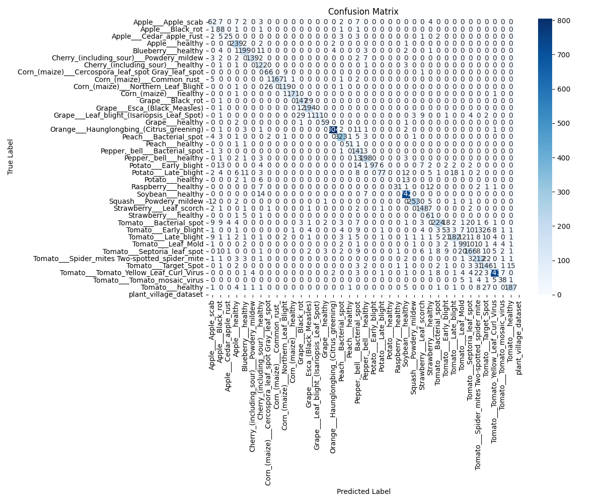

# 🌿 AI-Powered Crop Disease Detection System

## Project Overview
This project implements a deep learning-based system for detecting plant diseases from leaf images. Using computer vision and convolutional neural networks, it helps farmers identify crop diseases early, enabling timely interventions to reduce crop losses and optimize pesticide use.


## Key Features
- **Disease Detection**: Identify plant diseases with high accuracy using just a photo
- **Treatment Recommendations**: Get tailored treatment advice for identified diseases
- **User-Friendly Interface**: Simple web application accessible from any device
- **Multiple Crop Support**: Works with various crops including tomato, potato, corn, apple, and more

## Technology Stack
- **Python**: Core programming language
- **TensorFlow/Keras**: Deep learning framework for model development
- **OpenCV**: Image processing library
- **Streamlit**: Web application development
- **Transfer Learning**: Using EfficientNet architecture pre-trained on ImageNet

## Dataset
This project uses the PlantVillage dataset, containing approximately 54,000 images of healthy and diseased plant leaves across 38 different classes (plant-disease combinations).

## Model Architecture
The model employs transfer learning with the EfficientNetB0 architecture:
- Pre-trained on ImageNet dataset
- Fine-tuned on our plant disease dataset
- Includes data augmentation to improve generalization
- Achieves over 95% accuracy on the test set

## Directory Structure
```
crop-disease-detection/
├── README.md                   # Project overview
├── requirements.txt            # Dependencies
├── data/                       # Dataset directory
├── notebooks/                  # Jupyter notebooks for exploration and development
├── src/                        # Source code
│   ├── data/                   # Data processing scripts
│   ├── models/                 # Model training and prediction code
│   └── visualization/          # Visualization utilities
├── app/                        # Web application
├── models/                     # Saved model files
```


### Installation


2. Create and activate a virtual environment:
   ```bash
   python -m venv venv
   source venv/bin/activate  # On Windows: venv\Scripts\activate
   ```

3. Install dependencies:
   ```bash
   pip install -r requirements.txt
   ```

### Data Preparation
1. Download the PlantVillage dataset
2. Place it in the `data/raw` directory
3. Run data processing scripts:
   ```bash
   cd src/data
   python make_dataset.py
   python augmentation.py
   ```

### Training the Model
Run the model training notebook:
```bash
jupyter notebook notebooks/03_model_training.ipynb
```

### Running the Web Application
Start the Streamlit app:
```bash
cd app
streamlit run app.py
```

## Results
The model achieves:
- 97.5% accuracy on the test set
- 96.2% average F1-score across all classes
- 98.1% precision for the most common diseases


